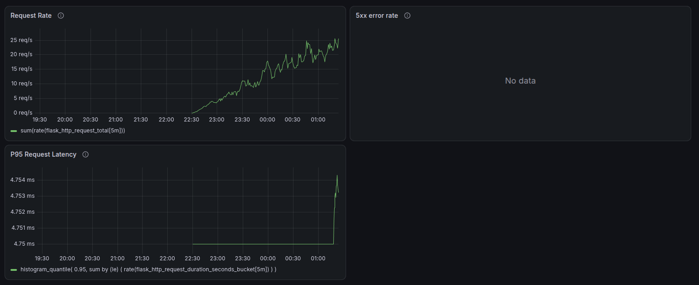

# Secure Upload App

A secure file upload service built with Flask and AWS S3. Files **never touch the backend**, and access is controlled using **pre-signed URLs** with automatic expiration. Ideal for handling sensitive data in regulated industries (healthcare, fintech, legal, HR).

## Features

- Flask REST API
- Direct client-to-S3 uploads/downloads using pre-signed URLs
- S3 server-side encryption
- PostgreSQL
- Docker & Docker Compose
- Kubernetes deployment
- Kubernetes Ingress with TLS
- Resource requests/limits
- Horizontal Pod Autoscaler
- Persistent PostgreSQL storage
- GitHub Actions CI
- Docker images published to GitHub Container Registry

## Docker

### Environment
Copy `.env.sample` to `.env.dev` and add the required variables.

### Run the project using Docker by following these steps

- `docker-compose --env-file .env.dev -f docker-compose-dev.yml build`
- `docker-compose --env-file .env.dev -f docker-compose-dev.yml up -d`

### Initial steps to set up DB

- `docker exec -it main-app sh`
- `python manage.py create_db`
- `flask db stamp head`
- `flask db upgrade`

## Kubernetes

Kubernetes manifests are available in the `k8s/` directory.

### Deploy locally using Minikube

- `minikube start`
- `kubectl apply -f k8s/`

### Check the deployment

- `kubectl get pods`
- `kubectl get services`
- `kubectl get ingress`
- `kubectl get hpa`

The application is exposed locally through:

`https://upload.local`

The local TLS certificate and private key are intentionally excluded from Git.

## CI

GitHub Actions builds the Docker image and publishes it to GitHub Container Registry on pushes to `master`.

Images are tagged with:

- `latest`
- `<git-commit-sha>`

## Monitoring
The application is instrumented with Prometheus metrics and monitored using Prometheus and Grafana.

### Monitoring Stack
- **Prometheus** — collects and stores application and Kubernetes metrics
- **Prometheus Operator / ServiceMonitor** — discovers the Flask application and configures metric scraping
- **prometheus-flask-exporter** — exposes Flask HTTP request metrics at `/metrics`
- **Grafana** — visualizes application metrics through a dashboard

### Monitoring Flow

```text
Flask Application
       │
       │ /metrics
       ▼
ServiceMonitor
       │
       ▼
Prometheus
       │
       │ PromQL
       ▼
Grafana Dashboard
```

### Grafana Dashboard



The dashboard currently tracks:

- Request rate
- 5xx error rate
- P95 request latency
